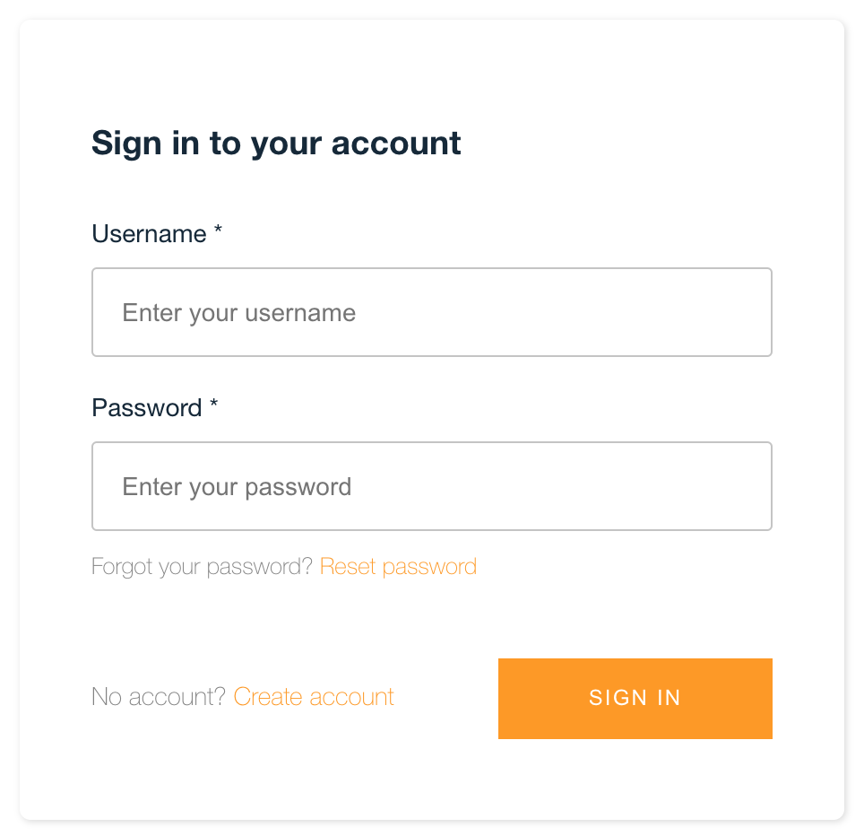

# Benvenuti su Transcribe 

## Cosa è Transcribe:

Un servizio di speech to text per i vostri audio.

Al momento il servizio è in beta, vi ringrazio per partecipare come pionieri!
Riporto sotto delle indicazioni, se non capite qualcosa, scrivetemi direttamente su info at(@) refacturing.com
con oggetto **transcribe: guida non ti capisco, ho una domanda** se avete una domanda sul servizio, oppure con oggetto **transcribe: guida non ti capisco, scrivi meglio** per indicarmi un typo o errori grossolani nella stesura

## Registrazione/Accesso

La registrazione richiede di inserire dei dati, ad esempio una username, che sarà usata per il login e un’email a cui vi arriveranno le notifiche per le avvenute trascrizioni più i campi standard richiesti, vi troverete davanti ad una schermata come questa

procedendo nella registrazione accettate la privacy policy, che vi segnalo di leggere, ma che in soldoni dice solo che i vostri dati sono usati per garantire il servizio e che potete farli cancellare comunicandomi la vostra scelta su info at(@) refacturing.com con l’oggetto “cancellazione dati servizio transcribe”  e dove nel corpo dovete indicarmi quale è la vostra username (Attenzione l’email usata deve essere la stessa di quella di registrazione e una volta cancellato l’account perderete l’accesso ai file precedenti)

Una volta registrati dovreste ricevere un’email con un codice, quest’ultimo è necessario per completare la registrazione

La sign-in è garantita inserendo username e password, se dimenticata la password potete reimpostarla cliccando su Reset password
    
Dopo la login in alto capeggia sempre il bottone di signout nella pagina degli upload, per uscire dal sistema

## Richiedere un piano

Per fare upload è richiesta l’attivazione di un piano(avere dei gettoni), se siete nuovi, potete farvi attivare un piano di prova dallo staff, che vi permetterà di avere un piano attivo con 3 gettoni, basta scrivere a t.me/riccardomancinelli e passarmi la vostra username, quindi prima di chiedere un piano assicuratevi di aver completato la registrazione. Se ricevete un piano di prova, dato che è un regalo mi auguro mi potrete ricambiare con un feedback sulla vostra esperienza nell’uso dell’applicativo o di suggerimenti per farlo evolvere, se continuerete ad usare il servizio sarà un regalo ancora più grande.

## Cosa sono e a cosa servono i gettoni

I gettoni consentono di continuare a fare upload e trascrivere i vostri file audio.
Non tutti gli upload sono uguali!
Al momento non si possono caricare file di dimensione superiore a circa 150 MB (Megabyte)
Il sistema conteggia, per ogni trascrizione, quanti gettoni servono per ogni file, sulla base delle dimensioni dello stesso.
Più è grande il file da sbobinare più gettoni occorrono.

## Acquistare dei gettoni
Per acquistare i gettoni si attiva una finestra  modale dove il pagamento avviene versando in un conto gestito dal sistema di pagamento Stripe, i gettoni si aggiungeranno tra i gettoni disponibili
Nel caso terminino i gettoni, l’area di upload scompare finché non saranno riacquistati nuovi gettoni

## Cosa serve il coupon

Potete fare a meno di coupon per aggiungere gettoni.
Il coupon non riduce il prezzo del piano scelto ma aggiunge gettoni a parità di prezzo del piano, quindi facciamo un esempio, se il piano che decidete di attivare è di 10 gettoni e pagate 10 euro, se siete in possesso di un coupon ancora attivo di 3 gettoni, continuerete a pagare 10 euro ma riceverete 13 gettoni invece che 10.

Il coupon una volta utilizzato nel pagamento sarà disattivato e non potrete utilizzarlo una seconda volta.

## Upload

I file supportati in questo momento sono con estensione e formato mp3 e il contenuto deve essere in lingua italiana

## Trascrizione

Le trascrizioni al momento supportano solo la lingua italiana.
La trascrizione è fatta da una macchina che si aspetta la lingua italiana, quindi il testo ottenuto andrà ricontrollato e ri-formattato, esempio se dite la parola inglese “Team" potrebbe scrivere “Tim" o se non scandite bene le parole potrebbe interpretare fischi per fiaschi. Ma è una macchina normale possa capitare.

La trascrizione è memorizzata nel sistema per un numero massimo di giorni pari a 90.
I limiti del servizio potrebbero subire cambiamenti nel tempo e verranno comunicati, seguitemi intanto sul canale telegram <a href="https://t.me/refacturingtranscribe" target="_blank">RefacturingTranscribe</a>

## Feedback/Supporto

Il sistema è pronto per segnalarmi eventuali errori nel sistema, ma potrebbero sempre sfuggirmene di nuovi e non adeguatamente monitorati. Se pensate che questo strumento possa migliorare in futuro, vi chiedo di segnalarmi eventuali problemi a info  at(@) refacturing.com 
Mettete nell’oggetto “transcribe: feedback” nel caso di un feedback
Mettete nell’oggetto “transcribe: problema” nel caso di un problema
e mettete sempre un recapito a cui posso contattarvi se necessario

Questa versione è in beta(che in informatica significa non ancora definitiva e stabile), è un servizio che ho creato per migliorare le vostre procedure di produzione contenuti, dietro ogni attività c’è sempre molto più lavoro di quello che appare. Vi chiedo di essere sempre comprensivi! Io darò il massimo.

Grazie

Refacturing Staff
