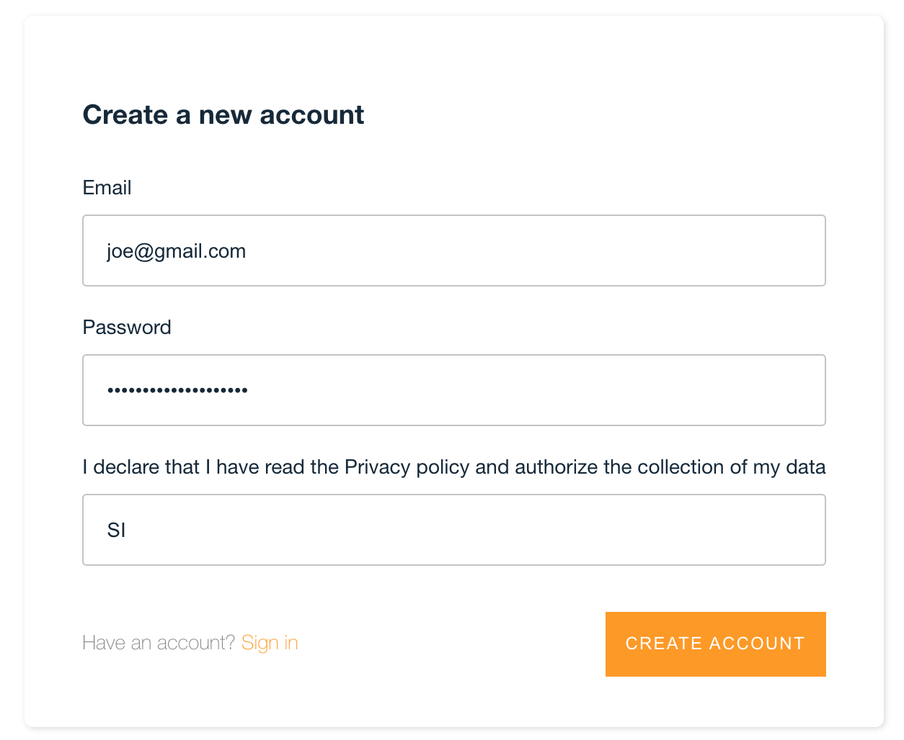

# Benvenuti su Transcribe 

## Cosa è Transcribe:

Un servizio di speech to text per i vostri audio.

Al momento il servizio è in beta, vi ringrazio per partecipare come pionieri!
Riporto sotto delle indicazioni, se non capite qualcosa, scrivetemi direttamente su info at(@) refacturing.com
con oggetto **transcribe: guida non ti capisco, ho una domanda** se avete una domanda sul servizio, oppure con oggetto **transcribe: guida non ti capisco, scrivi meglio** per indicarmi un typo o errori grossolani nella stesura, altrimenti se preferite la chat di Telegram andate su **t.me/riccardomancinelli**

## Registrazione/Accesso

La registrazione richiede di inserire dei dati, un’email sia per login che per ricevere le notifiche per le avvenute trascrizioni più i campi standard richiesti, vi troverete davanti ad una schermata come questa

procedendo nella registrazione, dopo aver inserito SI nel campo consenso, accettate la privacy policy, che vi segnalo di leggere, ma che in soldoni dice solo che i vostri dati sono usati per garantire il servizio e che potete farli cancellare comunicandomi la vostra scelta su info at(@) refacturing.com con l’oggetto “cancellazione dati servizio transcribe”  e dove nel corpo dovete indicarmi l'email usatanel servizio (Attenzione l’email usata deve essere la stessa di quella di registrazione e una volta cancellato l’account perderete l’accesso ai file precedenti)

Una volta registrati dovreste ricevere un’email con un codice, quest’ultimo è necessario per completare la registrazione

La sign-in è garantita inserendo email e password, se dimenticata la password potete reimpostarla cliccando su Reset password
    
Dopo la login in alto trovate sempre il bottone di signout nella pagina degli upload, per uscire dal sistema

## Cosa sono e a cosa servono i crediti

I crediti consentono di continuare a fare upload e trascrivere i vostri file audio.
Non tutti gli upload sono uguali!
Al momento non si possono caricare file di dimensione superiore a circa 150 MB (Megabyte)
Il sistema conteggia, per ogni trascrizione, quanti crediti servono per ogni file, sulla base delle dimensioni dello stesso.
Più è grande il file da sbobinare più gettoni occorrono.
Al momento potete comprendere il consumo sulla base di questi dati:

* 3 crediti => 4 euro
* 10 crediti => 12 euro
* 20 crediti => 22 euro

* se la dimensione del file è da <30MB(30 megabyte) il consumo sarà di 1 credito
* se la dimensione del file è compresa tra 30-60MB il consumo sarà di 2 crediti
* se la dimensione del file è compresa tra 60-90MB il consumo sarà di 3 crediti
* se la dimensione del file è compresa 90-120MB il consumo sarà di  4 crediti
* se la dimensione del file è >120MB ma minore di 150MB il consumo sarà di 5 crediti

## Acquistare dei crediti

Per acquistare i crediti si attiva una finestra  modale dove il pagamento avviene versando in un conto gestito dal sistema di pagamento Stripe, i gettoni si aggiungeranno tra i gettoni disponibili
Nel caso terminino i gettoni, l’area di upload scompare finché non saranno riacquistati nuovi gettoni.
Stiamo lavorando per inserire Paypal, se avete necessità di usare paypal scrivetemi sempre nei riferimenti che trovate in questa guida, e vi attiverò il numero di crediti che intendete pagare.

## Upload

I file supportati in questo momento sono con estensione e formato mp3 e il contenuto deve essere in lingua italiana

## Trascrizione

Le trascrizioni al momento supportano solo la lingua italiana.
La trascrizione è fatta da una macchina che si aspetta la lingua italiana, quindi il testo ottenuto andrà ricontrollato e ri-formattato, esempio se dite la parola inglese “Team" potrebbe scrivere “Tim" o se non scandite bene le parole potrebbe interpretare fischi per fiaschi. Ma è una macchina normale possa capitare.

La trascrizione è memorizzata nel sistema per un numero massimo di giorni pari a 90.
I limiti del servizio potrebbero subire cambiamenti nel tempo e verranno comunicati, seguitemi intanto sul canale telegram <a href="https://t.me/refacturingtranscribe" target="_blank">RefacturingTranscribe</a>

## Feedback/Supporto

Il sistema è pronto per segnalarmi eventuali errori nel sistema, ma potrebbero sempre sfuggirmene di nuovi e non adeguatamente monitorati. Se pensate che questo strumento possa migliorare in futuro, vi chiedo di segnalarmi eventuali problemi a info  at(@) refacturing.com 
Mettete nell’oggetto “transcribe: feedback” nel caso di un feedback
Mettete nell’oggetto “transcribe: problema” nel caso di un problema
e mettete sempre un recapito a cui posso contattarvi se necessario

Questa versione è in beta(che in informatica significa non ancora definitiva e stabile), è un servizio che ho creato per migliorare le vostre procedure di produzione contenuti, dietro ogni attività c’è sempre molto più lavoro di quello che appare. Vi chiedo di essere sempre comprensivi! Io darò il massimo.
Come sempre se preferite usare Telegram, scrivetemi su t.me/riccardomancinelli

Grazie

Refacturing Staff
